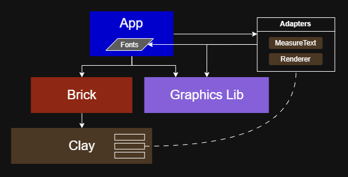

# Brick
### Render-agnostic, header-only UI Component Library for Clay

Brick is render agnostic UI component library extending the UI layout library [Clay](https://github.com/nicbarker/clay). Brick provides out-of-the-box components for quick and flexible use while retaining full performance and customization. Brick adds a very thin layer of state on top of Clay to keep track of components and their state, including an event system. 

## Features

- Library of UI elements, components, and containers
- Interchangeability with [Clay](https://github.com/nicbarker/clay)
- Basic UI state management
- UI events with flexible handling
- Seperation of content, layout, and styles
- Default and customizable styles
- Small STB header-only library for C99, C++20 and above
- Render agnostic

Future versions tentative features:
- Reactive layouts adapt to window resizing
- Default renderers for multiple graphics libs
- Unified style effects with shaders, i.e. drop shadows and gradients

## Contents

#### [Quick Start](#)

#### [Objectives](#)

#### [Setup](#)

#### [Overview](#)

#### [Examples](#)

#### [Components](#)

---

## Quick Start

## Objectives

Clay is a versatile UI layout library that provides an inline-style interface for creating any type of UI element. The inline configuration of every element will add up quickly with relatively simple UIs taking thousands of lines of code. This also means the content (button labels, text, etc.) is in the same area as the styles, which is in the same place as the layout structure. Brick aims to add UI components as primitive building blocks that can be combined in many ways to build any UI, as well as separating content, styles, and layout, while retaining interoperability with Clay for maximum flexibility.

Brick objectives include:
- adding UI state on top of Clay
- adding component events and a flexible way of handling them
- separating content, layout, and styles
- retaining ability to interchangeably use Clay alongside Brick
- responsive styles that adjust to window resizing
- global style configuration that can be overridden at different levels
- quick setup and quick start with reasonable defaults
- remaining render agnostic while providing default renderers and remaining compatible with Clay default renderers

## Setup

## Overview

## Examples

## Components

